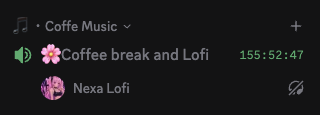
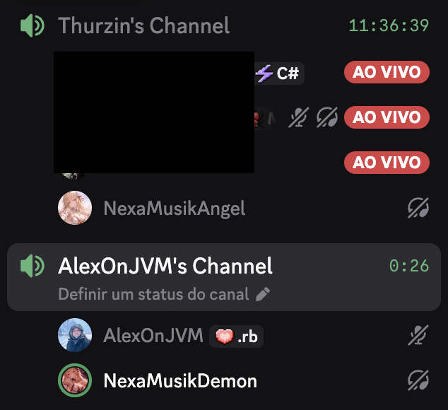

# Open Musik

Este é um projeto para tocar música em salas de voz do Discord, e ter um painel gerenciável.

Ele é composto por 2 tipos de Bot:

1. **bot-lofi**: toca rádio lo-fi (estação) em salas de voz

2. **bot-music**: toca música do Youtube em salas de voz

# Objetivos do Bot

1. Conseguir tocar a música e operar outros bots de música (como se fosse workers). Atualmente eu tenho 2 bots de música, se o primeiro estiver ocupado, ele invoca o segundo para tocar.

2. Quando não tenho a música, ele tem que conseguir buscar no Youtube e tocar.

3. Ter um processo de cache de músicas, para não precisar ficar baixando a mesma música toda hora. ( com TTL de 1 semana )

4. Ter um painel de controle para gerenciar o bot, como por exemplo, pausar, pular, etc.

5. Ter playlist por usuário, transversal por servidor.